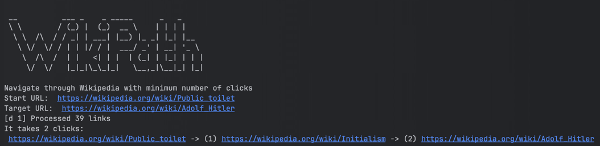

# 🌎 WikiPath

WikiPath helps you find the quickest route between Wikipedia pages. Perfect for WikiRaces!

## 🚀 Usage

1. Install Go and run:

```bash
go install github.com/loginchik/WikiPath@latest 
```

2. Run the executable:

```bash 
$GOPATH/bin/WikiPath --start=<WIKIPEDIA_URL> --target=<WIKIPEDIA_URL>
```
Optionally, specify the `depth` (default is 5) to limit recursion.

The tool will crawl links on the starting page and follow them until it finds the target URL or reaches the max depth.

Example: It takes just 2 clicks to get from "Public toilet" to "Hitler":
